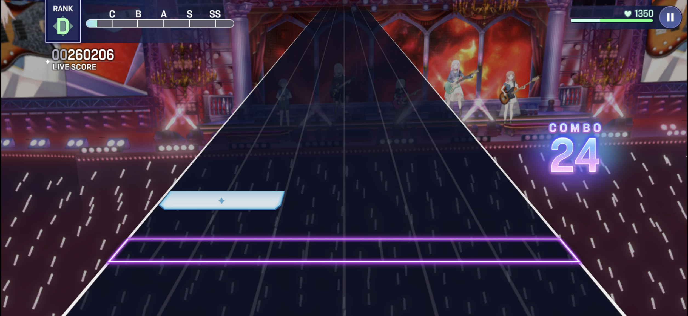
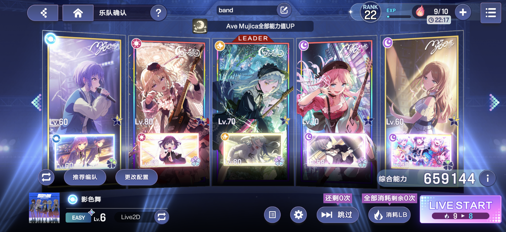

# BanG Dream! Our Notes — Human‑in‑the‑Loop Autoplay (no root)

> A stock Android phone plays the rhythm game by itself — **after you tap the first note.**
> No root, no emulator, no accessibility hacks.

[中文说明](README.zh-CN.md) · [How it works](docs/how-it-works.md) · [FAQ](docs/faq.md) · [Disclaimer](docs/disclaimer.md)



> **Verified platform: Windows PC + Android phone.** Everything here was measured and
> tested on that combination (Windows 10/11, Android 16). macOS, Linux and iOS devices
> are **not supported** and have not been tested. The previous release (v1.0.0) covered
> the same combination only.

---

## What this is

An autoplay for **BanG Dream! Our Notes** (the 2026 title) running on a **stock, unrooted**
Android phone over plain ADB.

The design is deliberately *human‑in‑the‑loop*:

1. you pick a song;
2. the script taps **LIVE START** for you;
3. when the first note reaches the judgement line, **you tap it yourself**;
4. the script takes over from the **second note** and plays the rest of the song.

Everything after your first tap is driven by the game's own chart data: taps, holds,
*moving* hold bars, and flick notes (up / left / right).

---

## Source code & download

| What | Where |
| --- | --- |
| **Full source code** | [YKLovePython/ournotes-autoplay](https://github.com/YKLovePython/ournotes-autoplay) |
| **Ready-to-run Windows build** (no Python needed, 98 MB, Windows + Android only) | [Releases](https://github.com/YKLovePython/ournotes-autoplay/releases) |
| **Timestamp proof** (Bitcoin + RFC 3161) | [`proof/`](proof/README.md) |

The implementation is public. The timestamped sealed archive
(`OurNotes-Autoplay-20261003.zip`, hash `80109e20…5b6af`) is attached to the code
repository's releases, so anyone can check the published archive against the Bitcoin
block — the whole chain is verifiable end to end.

Stuck? The portable build ships a one-click environment check (`一键自检.bat`, or
`人手起手.exe --check`): it verifies the libraries, data files, adb, the phone connection
and the touch-injection channel, and writes a report to `logs\自检_*.txt` to send to the
author. That is the fastest way to get a bug fixed.

---

## What is different about it

As of **2026‑09‑30** we could not find a public autoplay for this game. The closest
projects we found are for the *previous* BanG Dream title and require root or an emulator.
These are the parts that make this one work on a stock phone:

**1. The player's own finger is the clock, not a guess.**
The chart file carries no lead‑in timing and loading time varies, so "tap the start button
and wait N seconds" is hopeless: on the same device and the same day the measured
timing swung across **2.12s / 9.53s / 10.05s / 11.52s**, and a whole song's worth of notes
misses when that number is wrong. Instead the script reads the raw touchscreen, takes the
**kernel timestamp** of the player's first tap, and schedules everything relative to it.
Because the kernel timestamp is used, a slow read path only delays *when we start* —
it cannot shift *where the notes land*.

**2. Touch injection through a virtual HID touchscreen (no root).**
`sendevent` is blocked by SELinux on modern stock devices and `adb shell input` is
single‑finger and 60–80ms slow. This project injects through **scrcpy‑server's UHID
support**: the phone sees a genuine HID digitizer (`TOUCH | TOUCH_MT`) that the game
cannot distinguish from real hardware.

**3. Chart‑driven, not vision‑driven.**
The screen is only used for one coarse gate (are we on the band‑confirm page?).
Note positions and timing come from the game's chart data, so nothing depends on
detecting notes in a video stream — the approach that made earlier attempts drift.

**4. Hold bars are followed continuously, not held in place.**
Across all 340 charts we parsed, **15311 of 23073 hold bars move sideways** (52% have a
different head and tail position, and some move and come back). Measured slide speeds:
median 1258 px/s, 90th percentile 4346 px/s. Stepping the finger once per chart node
(≈157ms) means a median jump of **197px**, which is the same order as the bar's own
hit tolerance — the finger spends half the time off the bar, hence *intermittent* misses.
The finger is now resampled **by distance** (a step every ~50px of travel, never faster
than 40Hz), bringing the median step down to **72px**.

**5. Hold bars that end in a flick.**
**2512 of 23073 hold bars end with a flick** (up 1536 / left 492 / right 484) — the player
must keep holding *and then swipe off the end*. 200 more bars start with a flick.
Both are handled as real gestures: pre‑position to the bar's tail, swipe, then release.

---

## How it compares to the closest projects

We looked for prior art before writing anything. None of what follows is meant to belittle
those projects — several of them are why this one was possible — but the differences are
the whole point.

| Project | Game | Root / emulator | What decides the timing | Gesture coverage |
| --- | --- | --- | --- | --- |
| **phisap** (★211) | Phigros | no (uses scrcpy) | **a human taps a beat each run** (半自动) | taps, holds, drags |
| bandori‑cv‑autoplay | *previous* BanG Dream | **root or emulator required** | computer vision | CV‑derived |
| Autodori (2019) | *previous* BanG Dream (iOS) | jailbreak / AutoTouch | computer vision | limited |
| **this project** | BanG Dream! **Our Notes** | **neither** | **the player's own first tap, read as a kernel timestamp** | tap, hold, *moving* hold, hold‑ending flick, standalone flick |

The "human in the loop" idea is not new — phisap has a human tap a beat, and its author
wrote in a comment that audio streaming would be a better clock if the platform supported
it. What is different here:

* the reference is the **kernel timestamp of a real note hit inside the game**, not a
  beat tapped to a metronome — so the anchor is a moment the game itself accepted;
* it is used **once, for the whole song**, instead of a calibration value that has to hold
  across runs (the value we measured for the naive approach swung across 9 seconds);
* nothing about the play itself is vision‑based, so there is no detector to misfire;
* the gesture model was derived by **measuring all 340 charts** (how many hold bars move,
  how fast, how many end in a flick) rather than by handling the common case.

Where this project is *not* ahead: it does not read the game's memory, does not emulate
`sendevent`, does not attempt a full CV fallback, and does not automate the first note.
Those are deliberate limits, not oversights.

---

## Results (measured on a Xiaomi 2510DRK44C, Android 16, unrooted)

| Metric | Value |
| --- | --- |
| Anchor accuracy (lane of the first tap vs the chart) | within ~0.2 lane |
| Round‑trip latency of the touch read + inject path | ≈ 1 ms (persistent adb shell measures 0.7–1.5 ms) |
| Full‑chart regression (340 charts parsed and scheduled) | 0 failures |
| Actions scheduled / issued on a full song | all of them, verified in the log |
| Hold‑following step | median 72px (was 197px) |
| Peak injection rate | median 26/s, max 94/s (was 232/s) |



---

## How it works, in one picture

```
        you pick a song                     ┌───────────────────────────┐
              │                             │  chart data (340 songs)   │
              ▼                             │  notes: tap / hold / flick│
   ┌──────────────────┐                     │  hold bars carry a path   │
   │ script taps      │                     └───────────────────────────┘
   │ LIVE START       │                                  │
   └──────────────────┘                                  │
              │                                          │
              ▼                                          ▼
   ┌──────────────────┐     your first tap     ┌───────────────────────┐
   │ read raw         │◄───────────────────────│ kernel timestamp = t0 │
   │ touchscreen      │                        └───────────────────────┘
   │ (getevent)       │                                  │
   └──────────────────┘                                  ▼
              │                             ┌───────────────────────────┐
              └────────────────────────────►│ schedule every remaining  │
                                            │ note as a real gesture    │
                                            └───────────────────────────┘
                                                          │
                                                          ▼
                                            ┌───────────────────────────┐
                                            │ virtual HID touchscreen   │
                                            │ (scrcpy‑server UHID)      │
                                            └───────────────────────────┘
```

Read [docs/how-it-works.md](docs/how-it-works.md) for the longer version.

---

## Media

| File | What it shows |
| --- | --- |
| `media/01_live_combo24.png` | playing itself, combo running |
| `media/02_live_highscore.png` | a later point in the same song |
| `media/03_band_confirm.png` | the band‑confirm page the script waits on |

> Screen recordings of full runs are posted on Bilibili — see **Credits**.

---

## Author & community

* **作业快没了** on Bilibili — [welcome post / 交流贴](https://www.bilibili.com/opus/1254695612358590482)
* Questions about the script or the program? **QQ group: 933148159**

  > 从 github 来的朋友们，你们好
  > 对于我写的脚本和程序等等有疑问的
  > 可以加群讨论
  > Q群：933148159

* **Timestamp proof** (Bitcoin + RFC 3161 + commit history): see [`proof/`](proof/README.md).
  The sealed archive behind it is published in the code repository's releases, so the
  whole claim can be checked end to end.

## Credits

* The chart data pipeline builds on community projects (nnnotes, our‑notes‑chartdb,
  ournotes‑player, haneoka). Thanks to everyone who documented the file formats in public.
* Touch injection follows the approach used by `phisap` (scrcpy‑server UHID) — that
  project is for a different game, but the transport idea is theirs.

---

## Disclaimer

This project is published for **research and learning** — Android input injection,
HID, and rhythm‑game timing. It is not affiliated with the game's publisher.

Automating a live-service game may violate its terms of service and **can get an account
suspended**. Use it on an account you are willing to lose, never for ranking, never
commercially. The full source code lives in the
[code repository](https://github.com/YKLovePython/ournotes-autoplay).

See [docs/disclaimer.md](docs/disclaimer.md).

---

## License

Documentation and screenshots in this repository: **CC BY‑NC‑SA 4.0**.
The implementation is not included here and is not licensed for redistribution.

---

<details>
<summary>Keywords / 搜索关键词</summary>

BanG Dream Our Notes autoplay · バンドリ 自動演奏 · 音游 自动演奏 · 音游 脚本 ·
Android 免 root 触控注入 · UHID 虚拟触摸屏 · scrcpy UHID touch injection ·
getevent 触摸录制 · 内核时间戳对齐 · 人机协同 自动演奏 ·
rhythm game autoplay without root · HID touchscreen injection · ADB touch automation ·
chart-driven rhythm game bot · hold bar following · flick note swipe

</details>
